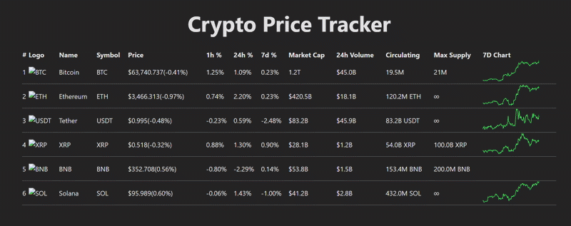

# Crypto Tracker

A real-time cryptocurrency price tracking application built with React, TypeScript, and Redux.



## Features

- Real-time price updates
- Color-coded price changes
- Responsive design
- Detailed cryptocurrency information
- Market cap and volume tracking

## Tech Stack

- **Frontend Framework**: React 18
- **Language**: TypeScript
- **State Management**: Redux Toolkit
- **Styling**: Tailwind CSS
- **Build Tool**: Vite
- **Real-time Updates**: WebSocket simulation
- **Type Checking**: TypeScript
- **Code Quality**: ESLint + Prettier

## Architecture

The application follows a modern React architecture with the following structure:

```
src/
├── components/     # Reusable UI components
├── store/         # Redux store configuration
├── services/      # API and WebSocket services
├── types/         # TypeScript type definitions
└── App.tsx        # Main application component
```

### Data Flow

1. **Initial Load**:
   - App loads mock data
   - Data is stored in Redux store
   - UI renders with initial data

2. **Real-time Updates**:
   - WebSocket service simulates price changes
   - Updates are dispatched to Redux store
   - UI re-renders with new data
   - Price changes are color-coded

## Setup Instructions

1. **Prerequisites**:
   - Node.js (v16 or higher)
   - npm (v7 or higher)

2. **Installation**:
   ```bash
   # Clone the repository
   git clone [repository-url]

   # Navigate to project directory
   cd crypto-tracker

   # Install dependencies
   npm install
   ```

3. **Development**:
   ```bash
   # Start development server
   npm run dev
   ```

4. **Building for Production**:
   ```bash
   # Build the application
   npm run build

   # Preview the production build
   npm run preview
   ```

## Environment Variables

No environment variables are required for this project as it uses mock data.

## Contributing

1. Fork the repository
2. Create a feature branch
3. Commit your changes
4. Push to the branch
5. Create a Pull Request

## License

This project is licensed under the MIT License - see the LICENSE file for details.

## Acknowledgments

- Cryptocurrency data is simulated for demonstration purposes
- Icons provided by [cryptologos.cc](https://cryptologos.cc)
